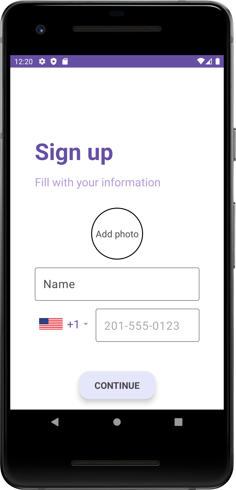
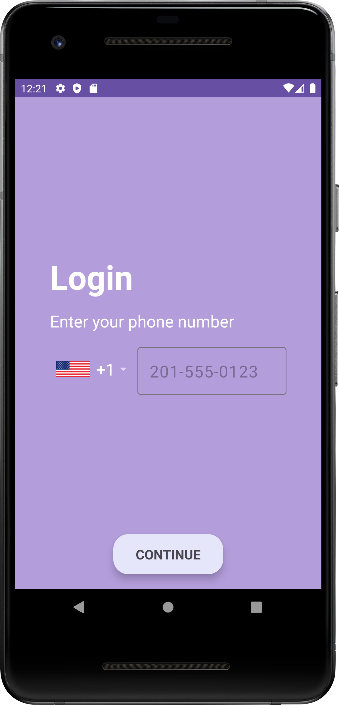
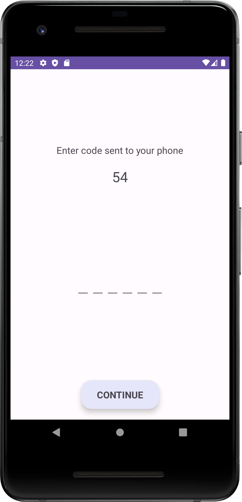
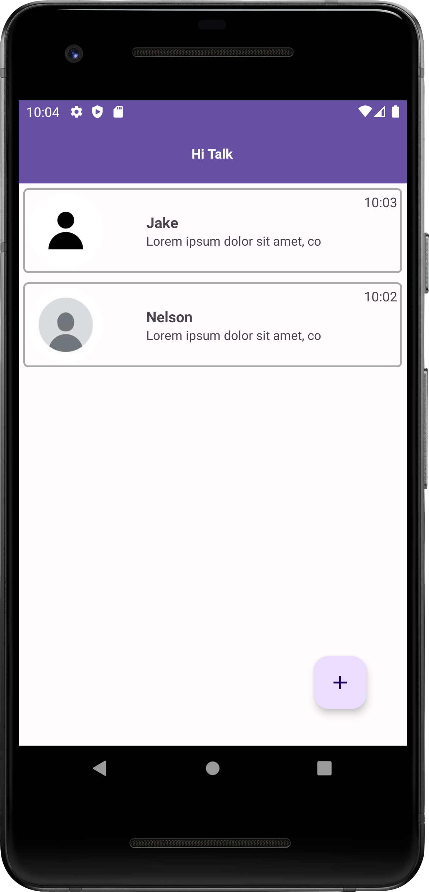
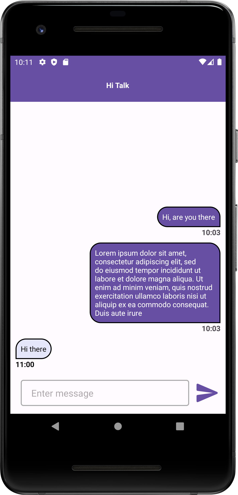
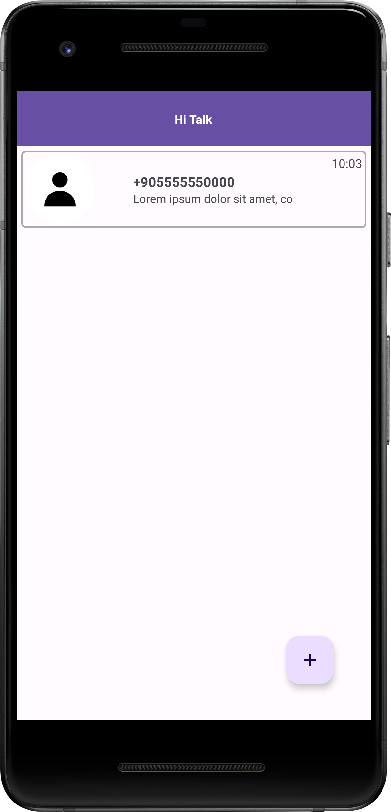

# Hi Talk - RealTime Messaging Made Easy

HiTalk is a realtime chat application designed to connect you with friends no matter where they are in the world.

## Key Features

- Register and login with phone numbers from worldwide.
- SMS authentication for securing user accounts.
- Set a profile image to let your friends know about you.
- Send realtime messages to your contacts.
- List all of your conversations.

## Techs & Arch
#### Techs
- Kotlin
- Android SDK
- Coroutines
- Flows
- ViewBinding-Databinding
- Navigation Component
- Jetpack Components
- Dagger-Hilt
- Realm
- Firebase
- Glide

#### Arch
- MVVM (Model-View-ViewModel)
- Clean Architecture Pattern

ScreenShots:

